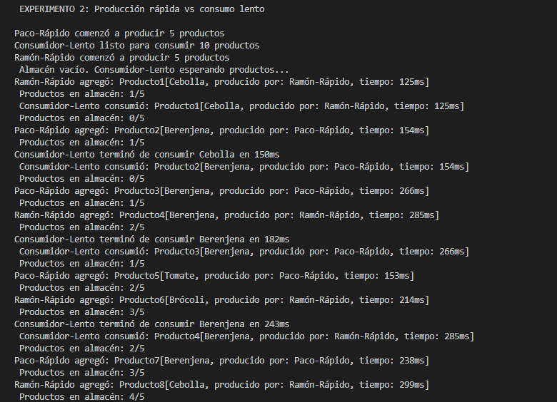
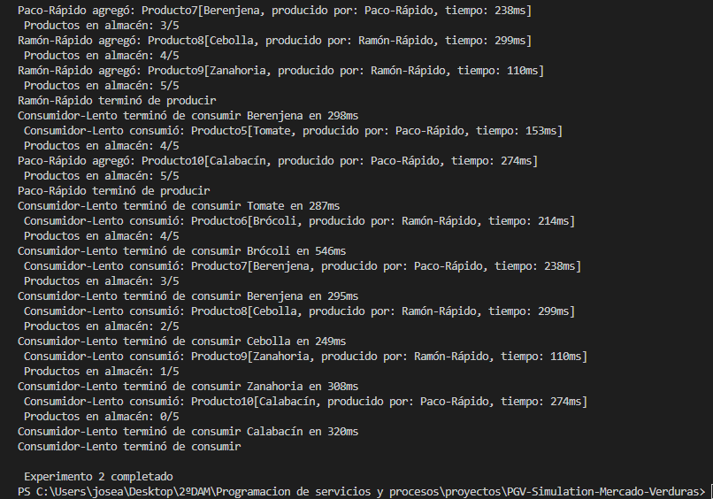

## Descripción del Proyecto
Este experimento prueba un escenario de desequilibrio donde los productores son más rápidos que los consumidores. Esto nos permite observar cómo el sistema maneja la congestión cuando la producción supera la capacidad de consumo.

# Configuración
Productores: 2 ("Paco-Rápido", "Ramón-Rápido")

Consumidores: 1 ("Consumidor-Lento")

Capacidad del almacén: 5 productos

Productos a generar: 10 (5 cada productor)

Productos a consumir: 10

Tiempo de producción: 100-300ms (RÁPIDO)

Tiempo de consumo: 500-1000ms (LENTO)

# Comportamiento Esperado
Los productores llenarán rápidamente el almacén

Frecuentes mensajes de "Almacén lleno"

Los productores pasarán mucho tiempo en estado de espera

El consumidor trabajará continuamente pero no podrá mantener el ritmo

# Capturas de Ejecución

# Análisis de Resultados
Observaciones:

Los productores completan su trabajo rápidamente pero luego esperan

El almacén permanece lleno la mayor parte del tiempo

El consumidor trabaja de manera constante pero lenta

Se observan múltiples llamadas a wait() por parte de los productores

# Conclusión: El sistema maneja correctamente la congestión, manteniendo la integridad de los datos incluso cuando la producción supera la capacidad de consumo.

